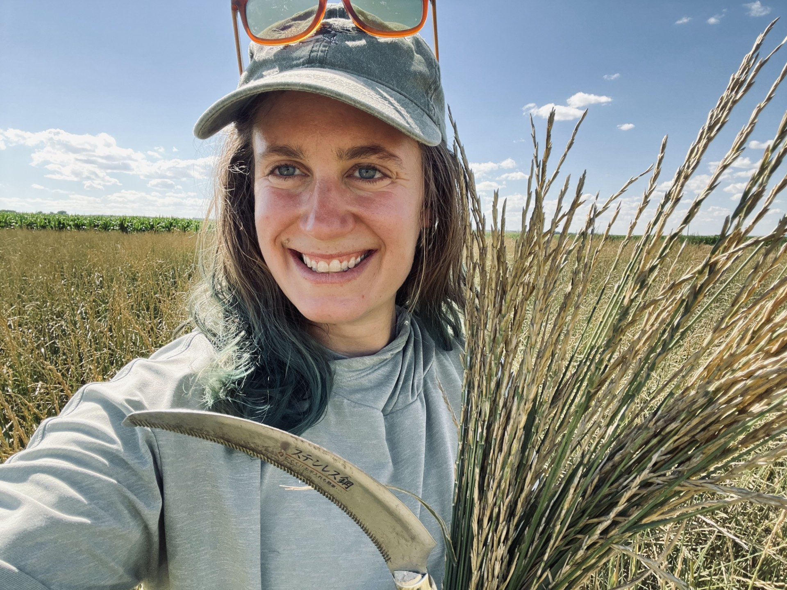

I am a soil scientist, with a focus on improving soil health in marginal dryland systems and working with farmers to create agricultural systems that are 
sustainable, resilient to climatatic stress (like drought!), and profitable. 
My work is informed by the concept of Natural Systems Agriculture, which studies 
agricultural systems that try to mimic our native ecosystems and the ecosystem 
services they provide. 

I received my PhD in soil science from the University of Wyoming (2020-2024), 
working with Jay & Urszula Norton and Linda van Diepen. My PhD research focused 
on how land management decisions can support soil health in semiarid grain 
production systems, and how soil microbes can help us predict changes in soil 
health. In particular, I studied a perennial grain called Kernza as a possible 
option for wheat-fallow agriculture. I also studied the impacts of Kernza plant 
breeding on the symbiotic bacteria and fungi that live on plant roots. 

Currently, I'm a fellow at the USDA Northern Plains Climate Hub. In this role,
I hopes to help find ways to enhance soil & crop health, productivity, economic 
security, and climate resilience, in part by facilitating collaboration among 
local farmers, researchers, and technical service providers.

Going farther back, I received a bachelor’s degree in biology from Oberlin 
College and worked as a research intern for a non-profit, science-based, 
research organization in Salina, Kansas. She also spent a year living in an 
agricultural village in Sindhupalchok, Nepal, teaching English through a 
Fulbright grant. In her free time, Hannah likes to hike, bike, and canoe around 
Laramie, Wyoming, and teaches pottery to community members.